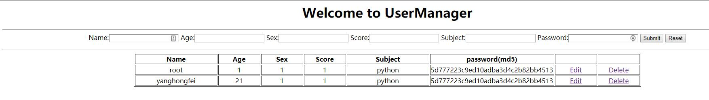
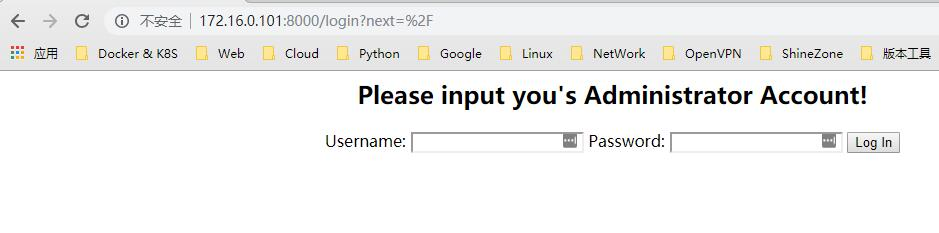
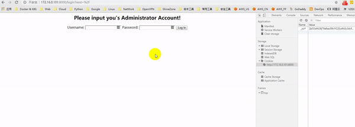

### 基于MVC设计练习的第一个用户管理系统
> 目前对MVC理解还不够透彻，可能代码逻辑里面会有一点问题，MVC: 模型—视图—控制器(Model-View-Controller，MVC)模式

## 实现功能
> Tornado练手，实现用户登陆，列出，添加，更新，删除，使用到一些技术点：Tornado用户认证，安全，ORM，sqlalchemy，md5加密等

## 创建数据库
```sql

mysql> CREATE DATABASE UserManager;
mysql> CREATE TABLE user(
        id int(16) not null primary key auto_increment,  #ID自增长
        username varchar(32) not null,
       	age int(3) not null,
        sex int(1) not null,
        score int(3) not null,
        subject varchar(32) not null,
        password varchar(32) not null );                 #密码MD5加密存储

或者: mysqldump -uuser -ppassword -hhost UserManager < schema.sql

```
## 效果图


## 登陆



